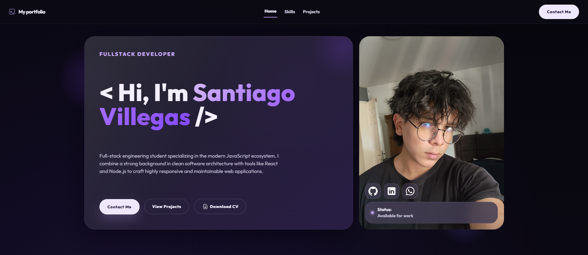
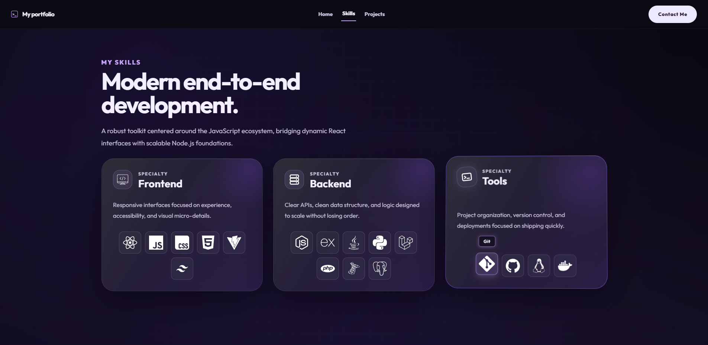

# 🚀 Santiago's Developer Portfolio

> A modern, fully responsive Full-Stack developer portfolio.

Welcome to the repository for my personal portfolio! This project showcases my technical skills, featured projects, and serves as a central hub for my professional journey as a Full-Stack Developer.

Check out the live site here:

### 📸 Live Demo Preview
*A quick look at the portfolio's interface.*

  
  

## 🛠️ Tech Stack

This project was built focusing on clean architecture and modern development practices:

* **Core:** React, JavaScript (ES6+), HTML5
* **Styling:** Custom CSS
* **Build Tool:** Vite
